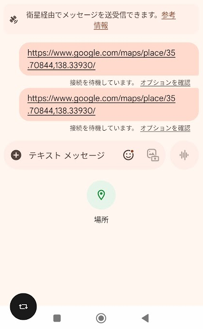
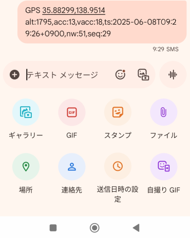
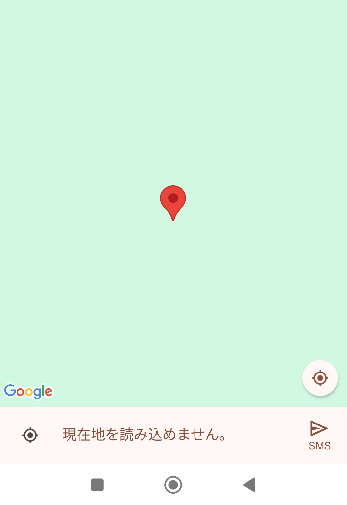

# AndroidでのDTC（au Starlink Direct）利用における現状の課題・問題点

このページでは、2025年春〜夏時点でau Starlink Direct / DTC (Direct to Cell) サービス利用時に確認された問題点と対策をまとめています。

* 目次
{:toc}

## Android 15 + メッセージアプリの位置情報共有機能が、中途半端な地上基地局圏内時に「現在地を読み込めません。」というエラーに陥る問題

### 何が起こるか

Android 15の標準「メッセージ」アプリで現在地を送ろうとすると、「現在地を読み込めません。」というエラーが表示されることがあります。

### いつ起こるか

この問題は以下のような状況でよく発生します：

- 山間部で地上基地局の電波が弱い場所

### なぜ起こるか

Android 15のメッセージアプリは、接続されているネットワークの種類によって位置情報の送り方を変えています：

- **衛星通信のみ**: シンプルな方法で座標を送信 → うまく動く
- **地上電波が少し入る状態**: 現在地座標から住所情報の取得を試みる（逆ジオコーディング）が電波品質が悪いため失敗 → エラーになる

つまり、中途半端に地上電波が入っている状態が一番問題となります。

### 動作確認環境

#### 確認端末
- **機種**: Xiaomi Redmi 12 5G

#### ソフトウェア環境
- **Android バージョン**: Android 15
- **Android リリースリビジョン**: Android 15 AQ3A.240912.001（Xiaomi HyperOS 2.0.3.0.VMWJPKD）
- **メッセージアプリバージョン**: （記載予定）

#### 確認日時
- **現象確認日**: 2025-05-18

### スクリーンショット

#### 正常動作時の画面

メッセージアプリの「+」メニューから「場所」ボタンのみが表示される場合は位置情報をそのまま衛星経由で送信できます。

#### 不具合発生時の画面

メッセージアプリの「+」メニューから「場所」以外のメニューも表示される場合、「場所」ボタンをタップ後に現在地取得→逆ジオコーディングを試みて失敗し、「現在地を読み込めません。」エラー表示となり、SMSに現在地を貼り付ける機能が動作しません。

### 対策・回避方法

#### 確実な対策

##### 1. 座標を手動で送信する（推奨）

最終的に送信されるのはテキストメッセージなので、座標を手動で取得して送信することで確実に位置情報を共有できます：

- **ヤマレコアプリ**: 現在地の座標を表示→画面を見ながら書き写す
- **YAMAPアプリ**: 現在地の座標を表示→画面を見ながら書き写す
- **Google Mapsアプリ**: 現在地を長押しして座標を表示→画面を見ながら書き写す
  （注：Google Mapsも通信不良時は逆ジオコーディングに失敗する場合があります）

取得した座標（例：35.123456, 139.123456）をそのままテキストで送信します。
アプリによっては時分秒での表示となる場合があります。

##### 2. 場所を移動する

- より山間部に移動して完全にDTC接続にする
- 地上電波の良い場所に移動する

#### 効果がない方法

##### 機内モードの利用

機内モードを使用してもこの問題は解決しません：

**なぜ効果がないか**: Androidでは機内モード時にDTC通信も無効化されるため、DTC専用接続にはなりません。機内モード中はメッセージの送信自体ができなくなります。

### 注意事項

この問題はau Starlink Directサービス自体の問題ではなく、Android OSとメッセージアプリの仕様によるものです。今後のAndroid OSまたはメッセージアプリのアップデートで改善される可能性があります。

### 技術的詳細

#### 問題の根本原因

Android 15のメッセージアプリは `isNonTerrestrialNetwork == true` 状態では簡易位置情報共有機能に切り替わり逆ジオコーディングを行わずGoogle MapsのベースURIに現在地座標をそのまま付与して送信するが、中途半端な地上基地局圏内状態ではフルのSMS/RCSインターフェースを利用するため逆ジオコーディングを試みて失敗し「現在地を読み込めません」というエラーに陥り、結果的に適切な現在地情報を送れないことがある、と推測しています。

#### 技術的な背景

Android標準のメッセージアプリが `isNonTerrestrialNetwork` フラグによる判定のみを以て逆ジオコーディングの実施可否を切り替えていることが根本原因と考えられます。

#### 動作パターンの詳細

- **isNonTerrestrialNetwork == true状態（DTC接続中）**: 
  - メッセージアプリの送信メニューがDTC環境用に最適化され、簡易位置情報共有機能に切り替わる
  - 逆ジオコーディングを行わない
  - Google MapsのベースURIに現在地座標を直接付与して送信
  - **結果**: 正常に動作

- **中途半端な地上基地局圏内状態（弱い地上波信号）**:
  - フルのSMS/RCSインターフェースを利用
  - 逆ジオコーディング処理を試行
  - ネットワーク品質不良により逆ジオコーディングが失敗
  - **結果**: 「現在地を読み込めません」エラーが発生し、適切な現在地情報を送信できない

#### 技術的なワークアラウンド方法

標準のメッセージアプリを利用せずにSMS送信メッセージを作成することを前提とし、特に山岳部での利用時には基本的に逆ジオコーディングの必要はないケースが多い（どのみち住所を取得することに意味がない）ので実施しない、というのが正攻法です。

#### 関連情報

- 

